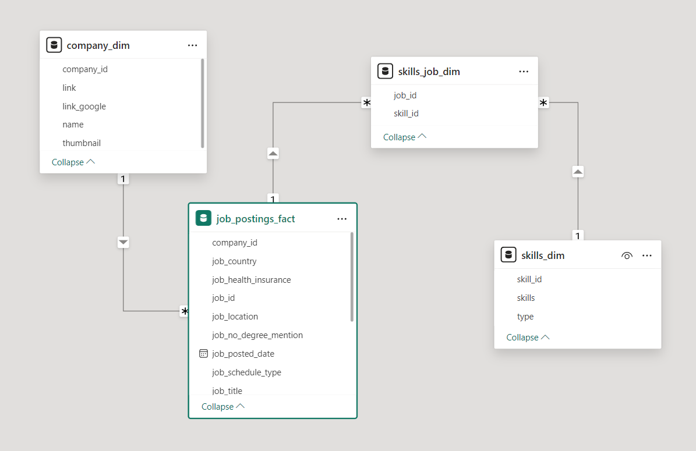
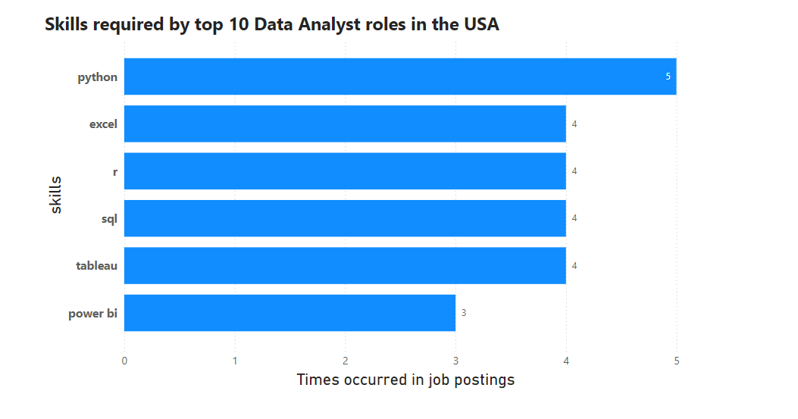

# Introduction
This project explores the current data job market in the United States, which focuses on DA (data analyst) roles. The project gives insights about top paid jobs, identifies highest in-demand skills, and proposes the most optimal skills for DA entering the job market within the USA.

# About the project
This project was inspired by a desire to identify high-paying and in-demand skills, lessening the burden of labour for others in search of optimal positions, and to better navigate the data analyst job market in the USA. This project aims to address the following 4 questions:
1. What are the highest-paid DA roles in the States?
2. What skills are required for these top-paying roles?
3. What are the most high-indemand skills for DA in the States?
4. What are the most optimal skills for DA to learn?

The SQL queries addressing the problem: [click here](sql_project)

The dataset hails from [SQL for Data Analytics](https://www.lukebarousse.com/sql) course by [Luke Barousse](https://www.youtube.com/@LukeBarousse)

# Tools and techniques
In order to fully explore the job market for data analysts, I utilised the following important tools:
- **SQL**: for querying and analysis of job postings data
- **PostgreSQL**: database management system for handling the job posting data.
- **PowerBI**: for visualizations of findings and insights
- **VS Code**: an editor for writing and running SQL code.
- **Git & GitHub**: for project tracking, version control, and script and analysis sharing.
# Data exploration
This section explores the dataset to better comprehend what our dataset is about




 First, we need to see total number of DA jobs in the USA
```SQL
SELECT
    COUNT(*) AS number_of_post
FROM job_postings_fact
WHERE job_country = 'United States'
```

This query gives us the result as below:

| number_of_post|
| -------- | 
| 206943  | 

Great! It's now time to explore what job titles appeared most of the time in the U.S job market:
```SQL
SELECT 
    job_title_short AS job_title,
    COUNT(job_id) AS job_title_count,
    ROUND((COUNT(*)/SUM(COUNT(job_id)) OVER()) * 100,2) AS percentage,
    ROUND(AVG(salary_year_avg),0) AS yearly_salary
FROM job_postings_fact
WHERE job_country = 'United States'
GROUP BY job_title_short
ORDER BY job_title_count DESC
```
The table below counts the number of each title appeared in all U.S job postings, how much it account for, and the average annual salary for each title:

Job_title | job_title_count | percentage | yearly_salary
--- | --- | --- | ---
Data Analyst | 67956 | 32.84 | 94504
Data Scientist | 59045 | 28.53 | 139967
Data Engineer | 35103 | 16.96 | 134614
Senior Data Scientist | 12988 | 6.28 | 159032
Senior Data Analyst | 11837 | 5.72 | 115837
Senior Data Engineer | 9433 | 4.56 | 150297
Business Analyst | 7401 | 3.58 | 96025
Software Engineer | 1820 | 0.88 | 134533
Machine Learning Engineer | 944 | 0.46 | 153525
Cloud Engineer | 416 | 0.20 | 120091

Let's focus more on the DA jobs, the query below finds the top 5 platforms that the DA roles are found:
```SQL
SELECT
    job_via,
    COUNT(job_id) AS number_of_post
FROM job_postings_fact
WHERE job_country = 'United States' AND
    job_title_short = 'Data Analyst'
GROUP BY job_via
ORDER BY number_of_post DESC
LIMIT 5
```
For Data Analyst jobs, most of them are found via LinkedIn, with more than 55000 posts, followed by BeBee, Trabajo.org, ZipRecruiter, and Indeed

| job_via         | number_of_post |
|--------------------|-----------------|
| via LinkedIn       | 55595           |
| via BeBee          | 23643           |
| via Trabajo.org    | 16842           |
| via ZipRecruiter   | 13770           |
| via Indeed         | 11911           |

Finally, let's dive in which companies in the U.S have the most job hiring posts for DA roles

```SQL
SELECT
    cd.name,
    COUNT(job_id) As number_of_post,
    ROUND(AVG(salary_year_avg),2) AS yearly_salary
FROM job_postings_fact
JOIN company_dim AS cd
    ON cd.company_id = job_postings_fact.company_id
WHERE job_country = 'United States' AND
    job_title_short = 'Data Analyst'
GROUP BY cd.name
ORDER BY number_of_post DESC
LIMIT 5
```
From the query, Robert Half seems to have a highest number of posts for DA jobs, with 958 posts in total, followed by Insight Global, Dice, and UnitedHealth Group

| name | number_of_post | yearly_salary |
|------|-----------------|---------------|
| Robert Half | 958  | 89094.34 |
| Insight Global                           | 829             | 92965.50      |
| Dice                                     | 589             | 107500.00     |
| UnitedHealth Group                       | 507             | 103464.29     |
| Get It Recruit - Information Technology  | 505             | 87612.32      |

Exciting! It is time to start answering the major 4 questions of the DA jobs in the USA

# Analysis
For this project, each query looked into a different facet of the employment market for data analysts. Here's how I answered each one:

### 1. What are the highest-paid DA roles in the States?

To find the top 10 highest-paid roles, I filtered data analyst title based on country and average yearly salary

```SQL
SELECT
    job_title,
    job_location,
    job_schedule_type,
    job_work_from_home,
    salary_year_avg,
    job_posted_date,
    cd.name AS company_name
FROM job_postings_fact
LEFT JOIN company_dim as cd 
    ON cd.company_id = job_postings_fact.company_id
WHERE job_title_short = 'Data Analyst' AND
    job_country = 'United States' AND
    salary_year_avg IS NOT NULL 
ORDER BY salary_year_avg DESC
LIMIT 10
```
- From the result, the top 10 paying DA roles range from $254000 to $375000, with companies like Illuminate Mission Solutions, Citigroup, Torc Robotics offering the highest paying jobs. 

- *HC Data Analyst, Senior* offered by Illuminate Mission Solutions appears to be the highest-paid in the industry, with $375000 annual salary. 

| job_title                                                          | job_location     | job_schedule_type | job_work_from_home | salary_year_avg | job_posted_date       | company_name                  |
|--------------------------------------------------------------------|------------------|---------------|----------------|---------------------|------------------------|--------------------------------|
| HC Data Analyst , Senior                                           | Bethesda, MD     | Full-time     | No             | 375000.0            | 2023-08-18 07:00:22   | Illuminate Mission Solutions   |
| Head of Infrastructure Management & Data Analytics - Financial...  | Jacksonville, FL | Full-time     | No             | 375000.0            | 2023-07-03 11:30:01   | Citigroup, Inc                 |
| Sr Data Analyst                                                    | Bethesda, MD     | Full-time     | No             | 375000.0            | 2023-04-05 12:00:12   | Illuminate Mission Solutions   |
| Director of Safety Data Analysis                                   | Austin, TX       | Full-time     | No             | 375000.0            | 2023-04-21 08:01:55   | Torc Robotics                  |
| Data Analyst                                                       | San Francisco, CA| Full-time     | No             | 350000.0            | 2023-06-22 07:00:59   | Anthropic                      |
| Head of Data Analytics                                             | Austin, TX       | Full-time     | No             | 350000.0            | 2023-10-23 05:01:05   | Care.com                       |
| Director of Analytics                                              | Anywhere         | Full-time     | Yes            | 336500.0            | 2023-08-23 12:04:42   | Meta                           |
| Research Scientist                                                 | San Francisco, CA| Full-time     | No             | 285000.0            | 2023-04-19 18:04:21   | OpenAI                         |
| Associate Director- Data Insights                                  | Anywhere         | Full-time     | Yes            | 255829.5            | 2023-06-18 16:03:12   | AT&T                           |
| Partner Technology Manager, Data Analytics and AI                  | Austin, TX       | Full-time     | No             | 254000.0            | 2023-07-28 13:01:20   | Google                         |

### 2. What skills are required for these top-paying roles?

With this enquiry, I want to look for the skills needed for the high-paying positions we just looked at. To do this, I first created a CTE (Common Table Expression) with the query answering the first question to look for the top 10 high paying DA roles. Then I joined the CTE with the skills data, giving insights into what employers value for high-paying positions.

```SQL
WITH top_paying_jobs AS (
    SELECT
        job_id,
        job_title,
        salary_year_avg,
        cd.name AS company_name
    FROM job_postings_fact AS job_postings
    LEFT JOIN company_dim as cd 
        ON cd.company_id = job_postings.company_id

    WHERE job_title_short = 'Data Analyst' AND
        job_country = 'United States' AND
        salary_year_avg IS NOT NULL

    ORDER BY salary_year_avg DESC
   LIMIT 10
)

SELECT 
    top_paying_jobs.*,
    sd.skills
FROM skills_job_dim AS sjd
JOIN skills_dim as sd
    ON sd.skill_id = sjd.skill_id
JOIN top_paying_jobs 
    ON top_paying_jobs.job_id = sjd.job_id
ORDER BY salary_year_avg DESC
```

Most Common Required Skills for the top 10 Data Analyst roles in the USA:

- Python: 5 occurrences
- SQL: 4 occurrences
- R: 4 occurrences
- Excel: 4 occurrences
- Tableau: 4 occurrences


*Bar graph visualizing the count of skills for the top 10 paying jobs for data analysts, created by PowerBI*

