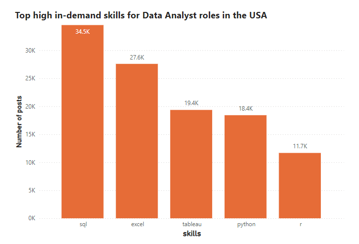

# Introduction
This project explores the current data job market in the United States, which focuses on DA (data analyst) roles. The project gives insights about top paid jobs, identifies highest in-demand skills, and proposes the most optimal skills for DAs entering the job market within the USA.

# About the project
This project was inspired by a desire to identify high-paying and in-demand skills, lessening the burden of labour for others in search of optimal positions, and to better navigate the data analyst job market in the USA. This project aims to address the following 4 questions:
1. What are the highest paying DA roles in the States?
2. What skills are required for these top-paying roles?
3. What are the most high in-demand skills for DAs in the States?
4. What are the most optimal skills for DAs to learn?

The SQL queries addressing the problem: [click here](sql_project)

The dataset hails from [SQL for Data Analytics](https://www.lukebarousse.com/sql) course by [Luke Barousse](https://www.youtube.com/@LukeBarousse)

# Tools and techniques
In order to fully explore the job market for data analysts, I utilised the following important tools:
- **SQL**: for querying and analyzing of job postings data
- **PostgreSQL**: database management system for handling the job posting data.
- **PowerBI**: for visualizations of findings and insights
- **VS Code**: an editor for writing and running SQL code.
- **Git & GitHub**: for project tracking, version control, and script and analysis sharing.
# Data exploration
This section explores the dataset to better understand what our dataset is about.


*The relational schema of the dataset*

 First, we need to see the total number of job postings in the USA
```SQL
SELECT
    COUNT(*) AS number_of_post
FROM job_postings_fact
WHERE job_country = 'United States'
```

This query gives us the result as below:

| number_of_post|
| -------- | 
| 206943  | 

Great! It's now time to explore what job titles appeared most of the time in the U.S job market.
```SQL
SELECT 
    job_title_short AS job_title,
    COUNT(job_id) AS job_title_count,
    ROUND((COUNT(*)/SUM(COUNT(job_id)) OVER()) * 100,2) AS percentage,
    ROUND(AVG(salary_year_avg),0) AS yearly_salary
FROM job_postings_fact
WHERE job_country = 'United States'
GROUP BY job_title_short
ORDER BY job_title_count DESC
```
The table below counts the number of times each job title is mentioned in all U.S. job postings, the percentage it accounts for, and the average annual salary for each title.

job_title | job_title_count | percentage | yearly_salary
--- | --- | --- | ---
Data Analyst | 67956 | 32.84 | 94504
Data Scientist | 59045 | 28.53 | 139967
Data Engineer | 35103 | 16.96 | 134614
Senior Data Scientist | 12988 | 6.28 | 159032
Senior Data Analyst | 11837 | 5.72 | 115837
Senior Data Engineer | 9433 | 4.56 | 150297
Business Analyst | 7401 | 3.58 | 96025
Software Engineer | 1820 | 0.88 | 134533
Machine Learning Engineer | 944 | 0.46 | 153525
Cloud Engineer | 416 | 0.20 | 120091

It is interesting to see that *data analyst*  is the highest in-demand title that takes up to nearly 33% of all job postings in the U.S

Focusing more on the DA jobs, the query below finds the average annual salary for U.S data analysts.
```SQL
SELECT 
      job_title_short,
      AVG(salary_year_avg) AS average
  FROM job_postings_fact
  WHERE job_title_short = 'Data Analyst' AND
      job_country = 'United States' 
  GROUP BY job_title_short
  ```
Running the query, the average salary for DA in the USA is around **$94,503 (USD)** per year. Now let's find out the top 5 job sites that have the highest number of DA job postings.
```SQL
SELECT
    job_via,
    COUNT(job_id) AS number_of_post
FROM job_postings_fact
WHERE job_country = 'United States' AND
    job_title_short = 'Data Analyst'
GROUP BY job_via
ORDER BY number_of_post DESC
LIMIT 5
```
For Data Analyst jobs, most of them are found via LinkedIn, with more than 55000 posts, followed by BeBee, Trabajo.org, ZipRecruiter, and Indeed.

| job_via         | number_of_post |
|--------------------|-----------------|
| via LinkedIn       | 55595           |
| via BeBee          | 23643           |
| via Trabajo.org    | 16842           |
| via ZipRecruiter   | 13770           |
| via Indeed         | 11911           |

Finally, let's dive in which companies in the U.S have the most job hiring posts for DA roles

```SQL
SELECT
    cd.name,
    COUNT(job_id) As number_of_post,
    ROUND(AVG(salary_year_avg),2) AS yearly_salary
FROM job_postings_fact
JOIN company_dim AS cd
    ON cd.company_id = job_postings_fact.company_id
WHERE job_country = 'United States' AND
    job_title_short = 'Data Analyst'
GROUP BY cd.name
ORDER BY number_of_post DESC
LIMIT 5
```
From the query, Robert Half seems to have a highest number of posts for DA jobs, with 958 posts in total, followed by Insight Global, Dice, and UnitedHealth Group.

| name | number_of_post | yearly_salary |
|------|-----------------|---------------|
| Robert Half | 958  | 89094.34 |
| Insight Global                           | 829             | 92965.50      |
| Dice                                     | 589             | 107500.00     |
| UnitedHealth Group                       | 507             | 103464.29     |
| Get It Recruit - Information Technology  | 505             | 87612.32      |

Exciting! It is time to start addressing the major 4 questions of the DA jobs in the USA

# Analysis
For this project, each query looked into a different facet of the employment market for data analysts. Here's how I answered each one:

### 1. What are the highest paying DA roles in the States?

To find the top 10 highest paying roles, I filtered *Data Analyst* title based on country and average yearly salary

```SQL
SELECT
    job_title,
    job_location,
    cd.name AS company_name,
    salary_year_avg,
    job_schedule_type,
    job_work_from_home,
    job_posted_date
FROM job_postings_fact
LEFT JOIN company_dim as cd 
    ON cd.company_id = job_postings_fact.company_id
WHERE job_title_short = 'Data Analyst' AND
    job_country = 'United States' AND
    salary_year_avg IS NOT NULL 
ORDER BY salary_year_avg DESC
LIMIT 10
```
- From the result, the top 10 paying DA roles range from *$254,000* to *$375,000*, with companies like Illuminate Mission Solutions, Citigroup, Torc Robotics offering the highest paying jobs. 

- *HC Data Analyst, Senior* and *Sr Data Analyst* offered by Illuminate Mission Solutions appears to be the highest-paid in the industry, with $375000 annual salary. 

| job_title                                                             | job_location      | company_name                 | salary_year_avg | job_schedule_type | job_work_from_home | job_posted_date        |
|-----------------------------------------------------------------------|-------------------|------------------------------|----------------------|----------------|-----------------|------------------------|
| Head of Infrastructure Management & Data Analytics - Financial...     | Jacksonville, FL  | Citigroup, Inc               | $375,000.0           | Full-time      | No              | 2023-07-03 11:30:01    |
| HC Data Analyst , Senior                                              | Bethesda, MD      | Illuminate Mission Solutions | $375,000.0           | Full-time      | No              | 2023-08-18 07:00:22    |
| Director of Safety Data Analysis                                      | Austin, TX        | Torc Robotics                | $375,000.0           | Full-time      | No              | 2023-04-21 08:01:55    |
| Sr Data Analyst                                                       | Bethesda, MD      | Illuminate Mission Solutions | $375,000.0           | Full-time      | No              | 2023-04-05 12:00:12    |
| Head of Data Analytics                                                | Austin, TX        | Care.com                     | $350,000.0           | Full-time      | No              | 2023-10-23 05:01:05    |
| Data Analyst                                                          | San Francisco, CA | Anthropic                    | $350,000.0           | Full-time      | No              | 2023-06-22 07:00:59    |
| Director of Analytics                                                 | Anywhere          | Meta                         | $336,500.0           | Full-time      | Yes             | 2023-08-23 12:04:42    |
| Research Scientist                                                    | San Francisco, CA | OpenAI                       | $285,000.0           | Full-time      | No              | 2023-04-19 18:04:21    |
| Associate Director- Data Insights                                     | Anywhere          | AT&T                         | $255,829.5           | Full-time      | Yes             | 2023-06-18 16:03:12    |
| Partner Technology Manager, Data Analytics and AI                     | Austin, TX        | Google                       | $254,000.0           | Full-time      | No              | 2023-07-28 13:01:20    |


### 2. What skills are required for these top-paying roles?

With this enquiry, I want to look for the skills needed for the high-paying positions we just looked at. To do this, I first created a CTE (Common Table Expression) with the query answering the first question to look for the top 10 high paying DA roles. Then I joined the CTE with the skills data, giving insights into what employers value for high-paying positions.

```SQL
WITH top_paying_jobs AS (
    SELECT
        job_id,
        job_title,
        salary_year_avg,
        cd.name AS company_name
    FROM job_postings_fact AS job_postings
    LEFT JOIN company_dim as cd 
        ON cd.company_id = job_postings.company_id
    WHERE job_title_short = 'Data Analyst' AND
        job_country = 'United States' AND
        salary_year_avg IS NOT NULL
    ORDER BY salary_year_avg DESC
   LIMIT 10
)

SELECT 
    top_paying_jobs.*,
    sd.skills
FROM skills_job_dim AS sjd
JOIN skills_dim as sd
    ON sd.skill_id = sjd.skill_id
JOIN top_paying_jobs 
    ON top_paying_jobs.job_id = sjd.job_id
ORDER BY salary_year_avg DESC
```

Most Common Required Skills for the top 10 highest paying Data Analyst roles in the USA:

- Python: 5 occurrences
- SQL: 4 occurrences
- R: 4 occurrences
- Excel: 4 occurrences
- Tableau: 4 occurrences


*Bar graph visualizing the count of skills for the top 10 paying jobs for data analysts, created by PowerBI*

### 3. What are the most high in-demand skills for DA in the States?
This query helps identify the top 5 highest in-demand skills for Data Analyst jobs in the USA, along with the frequency percentages that each skill occured in a job postings.

```SQL
WITH da_jobs AS (
  SELECT COUNT(job_id) as job_count
  FROM job_postings_fact
  WHERE job_title_short = 'Data Analyst' AND 
    job_country = 'United States'
  )

SELECT 
    sd.skills,
    COUNT(skills_job_dim.job_id) AS number_of_posts,
    COUNT(skills_job_dim.job_id) * 100 / (
      SELECT job_count FROM da_jobs
    ) as percentage_in_postings,
    sd.type
FROM skills_job_dim
JOIN skills_dim as sd
    ON sd.skill_id = skills_job_dim.skill_id
JOIN job_postings_fact AS job_postings
    ON job_postings.job_id = skills_job_dim.job_id

WHERE job_postings.job_title_short = 'Data Analyst' AND
    job_postings.job_country = 'United States'
GROUP BY sd.skill_id
ORDER BY number_of_posts DESC
LIMIT 5
```
| Skills  | Number of Posts | Percentage in Postings | Type          |
|---------|------------------|------------------------|---------------|
| SQL     | 34,505           | 50%                    | Programming   |
| Excel   | 27,576           | 40%                    | Analyst Tools |
| Tableau | 19,350           | 28%                    | Analyst Tools |
| Python  | 18,411           | 27%                    | Programming   |
| R       | 11,670           | 17%                    | Programming   |

From the result, it can be seen that SQL remains the most demanding skills from U.S recruiters, with 34505 posts and accounts for 50% of all job postings, followed by excel (40%), visualization tool Tableau, and Python and R as programming language. 



*Bar graph visualizing the count of top demanding skills for U.S data analysts, created by PowerBI*

### 4. What are the most optimal skills for DA to learn?

This section identifies the most optimal skills for DA jobs in the U.S market, based on the findings from queries above. The identified skills will have to satisfy both in high salaries and high demand, offering a practical and informative roadmap for DAs entering the job market. 

As mentioned in the ***Data exploration*** section, the average salary for data analysts in the U.S is *$94,503* US dollars. For this reason, a job's yearly salary needs to be higher than this average point to be considered a high-paid job. The query below identifies the top 20 skills associated with high-paid jobs and are high in-demand, prioritised by the number of times mentioned in hiring posts.
```SQL
--- Identify the average salary for DA jobs in the U.S
WITH average_salary AS (
  SELECT 
      job_title_short,
      AVG(salary_year_avg) AS average
  FROM job_postings_fact
  WHERE job_title_short = 'Data Analyst' AND
      job_country = 'United States' 
  GROUP BY job_title_short
),

--- Identify skills associated to well-paid jobs
well_paid_skills AS (
  SELECT 
      sd.skills,
      ROUND(AVG(job_postings.salary_year_avg), 0) AS "Yearly Salary",
      COUNT(skills_job_dim.job_id) AS number_of_posts
  FROM skills_job_dim
  JOIN skills_dim AS sd
      ON sd.skill_id = skills_job_dim.skill_id
  JOIN job_postings_fact AS job_postings
      ON job_postings.job_id = skills_job_dim.job_id
  WHERE job_postings.job_title_short = 'Data Analyst' AND 
      job_postings.salary_year_avg IS NOT NULL AND
      job_postings.job_country = 'United States'
  GROUP BY sd.skill_id, sd.skills
  HAVING ROUND(AVG(job_postings.salary_year_avg), 0) > 95000
  ORDER BY number_of_posts DESC
  LIMIT 20
)

--- Show skills, their corresponding salary, times mentioned in hiring posts, and percentage comparison to the average salary for all DA jobs
SELECT 
    ws.skills,
    ws."Yearly Salary",
    ws.number_of_posts,
    ROUND(ws."Yearly Salary" * 100/ average_salary.average, 2) AS percentage_compared_to_average
FROM well_paid_skills AS ws
CROSS JOIN average_salary;
```
| skills    | Yearly Salary | number_of_posts | percentage_compared_to_average |
|-----------|---------------|-----------------|-------------------------------|
| sql       | 97438         | 2514            | 103.11%                       |
| python    | 103390        | 1427            | 109.40%                       |
| tableau   | 99496         | 1366            | 105.28%                       |
| r         | 100292        | 893             | 106.13%                       |
| sql server| 95454         | 287             | 101.01%                       |
| oracle    | 101975        | 275             | 107.91%                       |
| go        | 99966         | 224             | 105.78%                       |
| flow      | 98495         | 216             | 104.22%                       |
| azure     | 105435        | 213             | 111.57%                       |
| aws       | 107376        | 211             | 113.62%                       |
| snowflake | 112329        | 193             | 118.86%                       |
| looker    | 107370        | 168             | 113.61%                       |
| vba       | 96724         | 146             | 102.35%                       |
| jira      | 108482        | 115             | 114.79%                       |
| alteryx   | 107410        | 106             | 113.66%                       |
| java      | 101742        | 99              | 107.66%                       |
| hadoop    | 114686        | 97              | 121.36%                       |
| spark     | 116324        | 95              | 123.09%                       |
| visio     | 102049        | 91              | 107.98%                       |
| ssis      | 99017         | 88              | 104.78%                       |


The result from the query gives us some interesting insights:
1. The highest average salaries in the top 20 are associated with *spark* ($116,324), *hadoop* ($114,686), and snowflake ($112,329), indicating that expertise in these technologies is highly valued in the Data Analyst job market in the United States.
2. While *sql* has the highest number of posts (2514), its average salary ($97,438) is slightly above the high salary threshold ($95,000) but not among the top earners. This suggests that while SQL is a fundamental and highly demanded skill, it does not command the top salaries compared to more specialized skills like spark and hadoop.
3. Skills such as *python*, *tableau*, and *azure* are notable for their balance of demand and pay. *Python* (1427 posts, $103,390), *tableau* (1366 posts, $99,496), and *azure* (213 posts, $105,435) highlight the growing importance of versatile programming, data visualization, and cloud computing skills in the field, with salaries significantly higher than the average for Data Analysts.

# Conclusion
## Key Insights

**1. Highest-Paid DA Roles in the United States**

- **Top Salaries**: The highest-paid Data Analyst roles range from $254,000 to $375,000 annually. Illuminate Mission Solutions offers the highest salary for the position of HC Data Analyst, Senior at $375,000.
- **Prominent Companies**: Companies like Citigroup, Torc Robotics, Anthropic, and Meta are also among the top payers, highlighting the lucrative opportunities in prominent tech and financial institutions.

**2. Most In-Demand Skills**
- **SQL**: SQL is the most demanded skill for Data Analyst roles in the United States, appearing in 50% of job postings.
- **Programming Languages**: Python and R are crucial programming skills, reflecting their importance in data manipulation and statistical analysis.
- **Visualization Tools**: Tableau is highly valued for data visualization, appearing in a significant number of job postings.
- **Excel**: Excel remains a fundamental skill, highlighting its continued relevance in data analysis tasks.

**3. Optimal Skills for Data Analysts**

- **High-Paying Skills**: Skills such as Spark ($116,324), Hadoop ($114,686), and Snowflake ($112,329) offer the highest salaries in the top 20 skills, indicating a premium for expertise in these areas.
- **Balanced Demand and Pay**: Skills like Python, Tableau, and Azure strike a balance between high demand and high pay, making them optimal for aspiring Data Analysts.
- **Emerging Technologies**: Proficiency in cloud computing (Azure, AWS) and data engineering tools (SQL Server, Oracle) is increasingly valued, suggesting a shift towards more integrated data management and analysis capabilities.

These insights offer a roadmap for aspiring Data Analysts, highlighting the skills that are both in high demand and command higher salaries in the U.S. job market. This information can guide career development and skill acquisition to maximize opportunities and earning potential in the field.

## Final Thoughts

This project highlights key insights into the Data Analyst job market in the United States, emphasizing the importance of acquiring high-demand skills like SQL, Python, R, Tableau, and cloud technologies such as Azure and AWS, which offer competitive salaries. To succeed in this dynamic field, aspiring Data Analysts should focus on continuous learning, networking, and gaining practical experience. By doing so, they can effectively navigate and excel in the data-driven job market, positioning themselves for successful and rewarding careers.